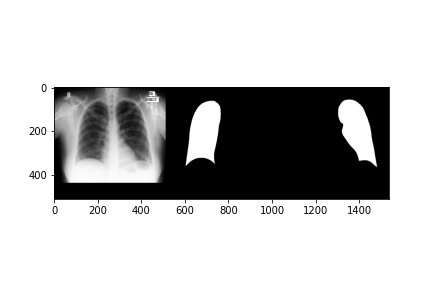
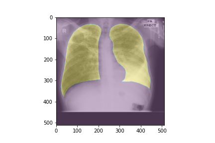
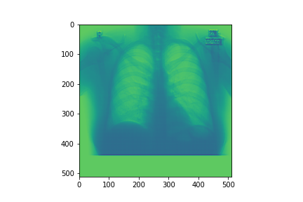
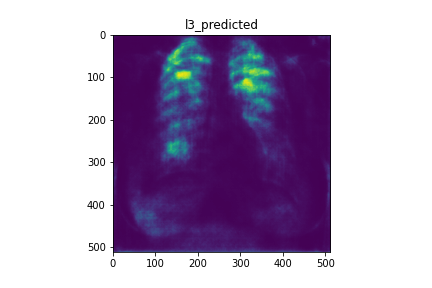

# Lung-segmentation-Unet

### Model architecture

- Dataset: https://academictorrents.com/details/ac786f74878a5775c81d490b23842fd4736bfe33

- Number of image in dataset: 139 

- Image shape: `(1024,1024,3)`, `(512,512,3)`

- Model file `model.h5`

- learning_rate `1e-5`

### Dataset

### Ouput

### Prediction & Evaluation

### References

https://www.youtube.com/watch?v=J_XSd_u_Yew&list=PLsM05n4rlXWSVv0mNvv04EBI6fnQ8_ihR&index=63&t=1111s

https://github.com/bnsreenu/python_for_microscopists.git

https://www.youtube.com/watch?v=LkmgdNpcgTM

https://github.com/nikhilroxtomar/Lung-Segmentation-in-TensorFlow-2.0/tree/main/UNET
